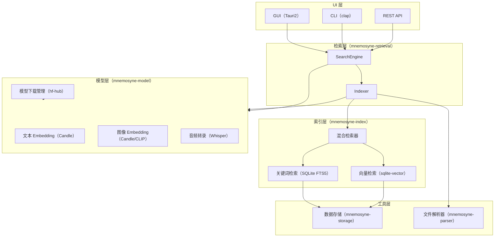
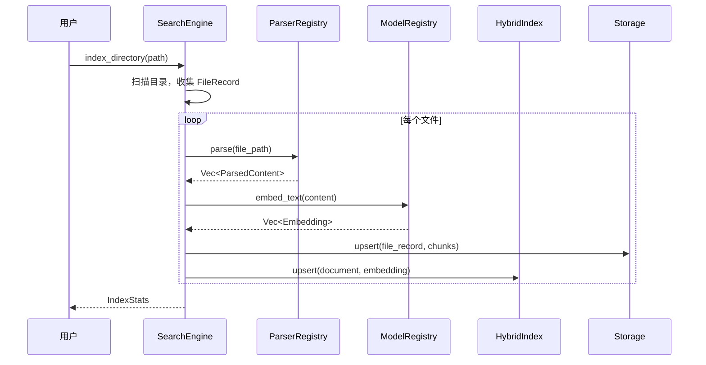
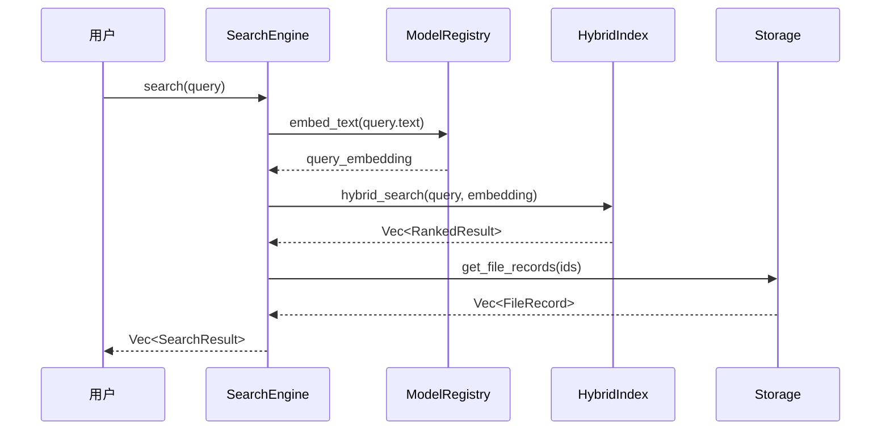

# Mnemosyne 架构文档

> 本地文件智能搜索与分析系统

---

## 1. 系统概览



---

## 2. Crate 结构

```
Mnemosyne/
├── Cargo.toml                    # Workspace 根
├── package.json                  # 前端依赖（Tauri）
├── src/                          # 前端（HTML/CSS/JS）
│   └── index.html
├── src-tauri/                    # Tauri2 GUI 应用
│   ├── Cargo.toml
│   ├── build.rs
│   ├── tauri.conf.json
│   ├── capabilities/
│   │   └── default.json
│   └── src/
│       ├── main.rs
│       ├── lib.rs
│       └── commands/             # Tauri IPC 命令
│           ├── mod.rs
│           ├── search.rs
│           └── index.rs
├── cli/                          # CLI 二进制
│   ├── Cargo.toml
│   └── src/
│       └── main.rs
└── crates/
    ├── mnemosyne-core/           # 核心类型、Trait、错误定义
    ├── mnemosyne-storage/        # SQLite 存储层
    ├── mnemosyne-model/          # 模型加载与推理
    ├── mnemosyne-parser/         # 文件解析插件系统
    ├── mnemosyne-index/          # 混合检索索引
    └── mnemosyne-retrieval/      # 检索编排（上层门面）
```

---

## 3. 各层职责

### 3.1 mnemosyne-core（核心层）

> 所有 crate 的基础依赖，不依赖其他内部 crate。

| 模块 | 内容 |
|------|------|
| `error` | 统一错误类型 `Error`（thiserror） |
| `types` | `FileType`, `FileRecord`, `ParsedContent`, `Embedding`, `SearchQuery`, `SearchResult` |
| `traits` | `FileParser`, `EmbeddingModel`, `SearchIndex` trait 定义 |

### 3.2 mnemosyne-storage（存储层）

> 封装所有 SQLite 操作，使用 `rusqlite`（bundled）。

**数据表：**

```sql
files           -- 文件元数据记录
document_chunks -- 文件内容分块（大文件切分）
embeddings      -- 向量数据（BLOB 或 sqlite-vector）
fts_chunks      -- FTS5 虚拟表（全文检索）
model_registry  -- 已下载模型记录
```

**核心接口：**
- `Database::open(path)` — 初始化/打开数据库
- `FileRepo::upsert/get/list/delete` — 文件 CRUD
- `ChunkRepo::upsert/get_by_file` — 分块 CRUD
- `EmbeddingRepo::upsert/get_by_chunk` — 向量 CRUD

### 3.3 mnemosyne-model（模型层）

> 加载和运行预训练 Embedding 模型，基于 `candle`。

| 组件 | 说明 |
|------|------|
| `ModelRegistry` | 管理已加载模型，避免重复加载 |
| `TextEmbedder` | BERT/sentence-transformers 文本 Embedding |
| `ImageEmbedder` | CLIP 图像 Embedding（stub） |
| `AudioTranscriber` | Whisper 音频转录（stub） |
| `ModelDownloader` | 基于 `hf-hub` 从 HuggingFace 下载模型 |

**推荐模型：**
- 文本：`sentence-transformers/all-MiniLM-L6-v2`（384维，轻量）
- 图像：`openai/clip-vit-base-patch32`
- 音频：`openai/whisper-tiny`

### 3.4 mnemosyne-parser（解析层）

> 插件化文件解析架构。

```rust
pub trait FileParser: Send + Sync {
    fn supported_extensions(&self) -> &[&'static str];
    async fn parse(&self, path: &Path) -> Result<Vec<ParsedContent>>;
}
```

**内置解析器：**

| 解析器 | 支持格式 | 依赖 |
|--------|----------|------|
| `TextParser` | txt, md, csv, json, toml, yaml | 无 |
| `PdfParser` | pdf | `pdf-extract`（可选） |
| `ImageParser` | jpg, png, bmp, webp | 图像读取 + CLIP |
| `AudioParser` | mp3, wav, flac | Whisper |
| `VideoParser` | mp4, avi, mov | ffmpeg 绑定（stub） |

**ParserRegistry**：按文件扩展名路由到对应解析器，支持运行时注册新解析器。

### 3.5 mnemosyne-index（索引层）

> 混合检索：向量检索 + FTS5 关键词检索，结果 RRF 融合排名。

```
HybridIndex
├── VectorEngine  — cosine similarity via sqlite-vector
├── FtsEngine     — SQLite FTS5 BM25
└── RrfRanker     — Reciprocal Rank Fusion 融合排名
```

**检索流程：**
1. 向量检索返回 top-K 候选
2. FTS5 返回 top-K 候选
3. RRF 融合两组结果，返回最终排名

### 3.6 mnemosyne-retrieval（检索编排层）

> 系统门面，协调各层完成索引和检索两条主路径。

**索引路径：**
```
scan_dir → [FileRecord] → Parser → [ParsedContent] → EmbeddingModel → [Embedding] → Index + Storage
```

**检索路径：**
```
SearchQuery → EmbeddingModel → query_embedding → HybridIndex → [SearchResult]
```

---

## 4. 数据流

### 4.1 文件索引流



### 4.2 搜索流



---

## 5. 存储 Schema

```sql
-- 文件元数据
CREATE TABLE files (
    id           TEXT PRIMARY KEY,
    path         TEXT NOT NULL UNIQUE,
    file_type    TEXT NOT NULL,           -- 'Text'|'Image'|'Audio'|'Video'
    size         INTEGER NOT NULL,
    modified_at  INTEGER,                 -- Unix timestamp
    indexed_at   INTEGER,
    content_hash TEXT                     -- SHA-256 用于增量更新检测
);

-- 内容分块（长文件按段切分）
CREATE TABLE document_chunks (
    id          TEXT PRIMARY KEY,
    file_id     TEXT NOT NULL REFERENCES files(id) ON DELETE CASCADE,
    chunk_index INTEGER NOT NULL,
    content     TEXT NOT NULL,
    UNIQUE(file_id, chunk_index)
);

-- FTS5 全文索引
CREATE VIRTUAL TABLE fts_chunks USING fts5(
    content,
    content='document_chunks',
    content_rowid='rowid',
    tokenize='unicode61'
);

-- 向量 Embedding 存储（未来迁移至 sqlite-vector）
CREATE TABLE embeddings (
    chunk_id  TEXT PRIMARY KEY REFERENCES document_chunks(id) ON DELETE CASCADE,
    model_id  TEXT NOT NULL,
    embedding BLOB NOT NULL              -- f32 小端序字节数组
);

-- 已下载模型注册表
CREATE TABLE model_registry (
    model_id    TEXT PRIMARY KEY,
    local_path  TEXT NOT NULL,
    version     TEXT,
    downloaded_at INTEGER
);
```

---

## 6. UI 接口设计

### 6.1 Tauri IPC 命令

| 命令 | 参数 | 返回 |
|------|------|------|
| `index_directory` | `{ path: string }` | `IndexStats` |
| `search_files` | `SearchQuery` | `SearchResult[]` |
| `get_indexed_files` | `{ limit, offset }` | `FileRecord[]` |
| `get_stats` | — | `IndexStats` |
| `remove_file` | `{ id: string }` | — |
| `list_models` | — | `ModelInfo[]` |
| `download_model` | `{ model_id: string }` | — |

### 6.2 CLI 子命令

```
mnemosyne index <PATH>              # 索引目录
mnemosyne search <QUERY> [OPTIONS]  # 搜索
mnemosyne list [--type text|image]  # 列出已索引文件
mnemosyne stats                     # 显示统计信息
mnemosyne models list               # 列出已下载模型
mnemosyne models download <ID>      # 下载模型
mnemosyne serve [--port 8080]       # 启动 REST API 服务
```

### 6.3 REST API

```
POST /api/index          body: { path }
POST /api/search         body: SearchQuery
GET  /api/files          query: ?limit&offset&type
GET  /api/stats
DELETE /api/files/:id
GET  /api/models
POST /api/models/download body: { model_id }
```

---

## 7. 开发计划

| 阶段 | 内容 | 状态 |
|------|------|------|
| Phase 0 | 项目骨架、Workspace、CI | ✅ 进行中 |
| Phase 1 | 存储层 + 文本解析器 + 文本 Embedding | 待实施 |
| Phase 2 | FTS5 关键词检索 + 基础 GUI | 待实施 |
| Phase 3 | 向量检索 + 混合检索 RRF | 待实施 |
| Phase 4 | 图像 CLIP Embedding + 音频 Whisper | 待实施 |
| Phase 5 | 视频关键帧提取 + 性能优化 | 待实施 |
| Phase 6 | CLI 完善 + REST API | 待实施 |

---

## 8. 关键技术决策

| 决策 | 选择 | 理由 |
|------|------|------|
| 运行时 | Tokio | 与 Tauri2 兼容，生态完善 |
| 向量存储 | sqlite-vector (SQLite 扩展) | 无额外服务依赖，嵌入式 |
| 关键词检索 | SQLite FTS5 | 内置，支持中文 unicode61 |
| 模型推理 | candle (CPU/Metal) | 纯 Rust，无 Python 依赖 |
| 模型下载 | hf-hub | 官方 HuggingFace Rust 客户端 |
| IPC | Tauri2 Commands | 类型安全，支持 Rust↔JS |
| 错误处理 | thiserror + anyhow | 库用 thiserror，应用层用 anyhow |
